# Juice Shop

Assume you’ve opened a **“juice shop”**, and you want to improve your business.

  

 

 

 

If you are smart enough, you’ll start recording sales data to understand your business.

**What kind of data you’ll record?**

# Collecting Data

* Temporal data

* Text data

    - text

    - categorical

* Numerical data

    - Continuous

    - Discrete

    - Categorical

    

 

 

 

# Sorting Data

Sorting by Sales

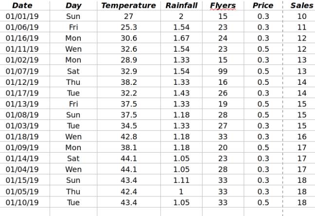

Or based on Flyers

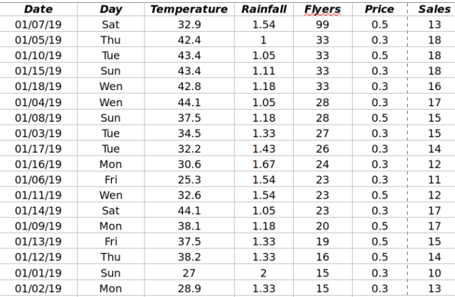

Outliers:

 * Data points far away from others

 * Outliers can largely affect the analysis.

 * Outliers might be mistakes or very rare

 

 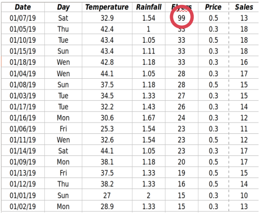

 

# Filtering

We can filter data based on any criteria on any of the fields.

  

* Day=’Sat’ or ‘Sun

 

 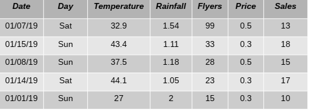

 

  

* Temperature < 30

 

 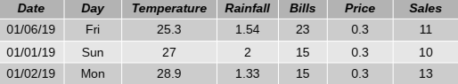

 

# Drive values from existing data

* You can do any kind of calculation on any field

    - Change temperature from C° to F°

    - Adding a Month field

* Or generate a new field by combining already existing fields

    - Revenue: Sales*Price

  

 

 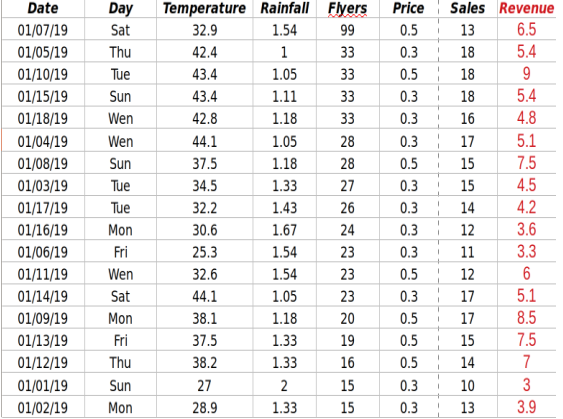

 

---
layout: default
title: Aggregating data
lang-ref: chapter2.1
---

 * We can use aggregating functions (e. g., sum) to summarize data and get feel as a whole.

   

 

 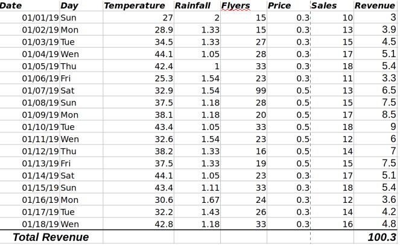

 

 

 * Count, Distinct Count, Sum, Min, Max

  

 

 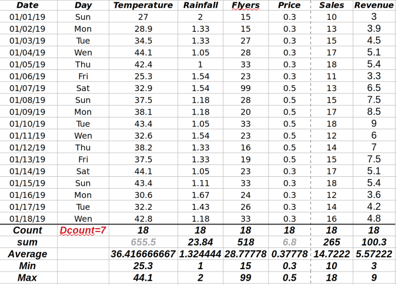

 

# Highlighting Data

 Interpreting numbers in large tables is difficult.

 * We can use heatmaps to visualize the scale of values

  

 

 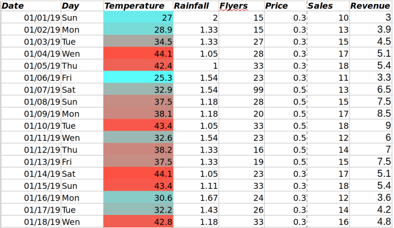

 

  

* We can use “data bars” to visualize the scale of values

  

 

 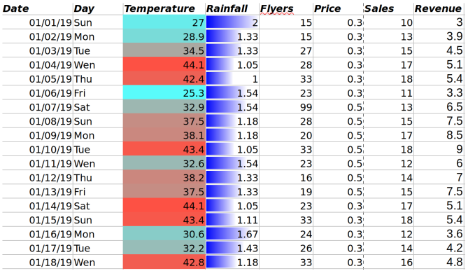

 

  

* We can highlight individual values that fall within sum criteria:

  - e. g., top 30% (good days) and less 30% (bad days) Revenues

  

 

 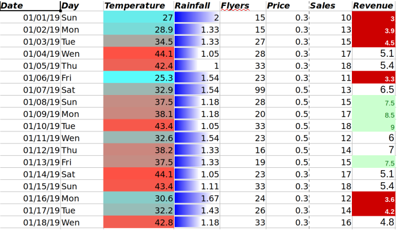

 

# Grouping Data

It is common to group data by categorical fields and compute subtotal values

  

 

 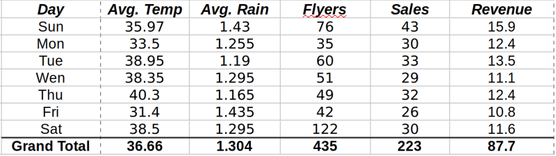

 

 On more than one field

  

 

 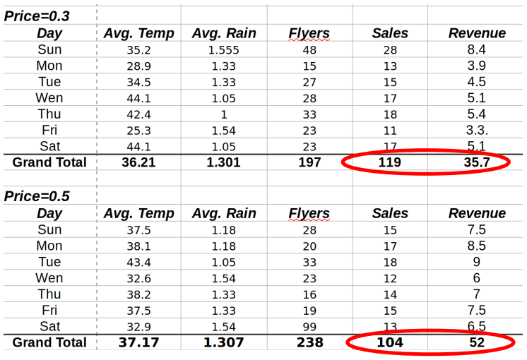

 

Is Price=50 always better?

 

 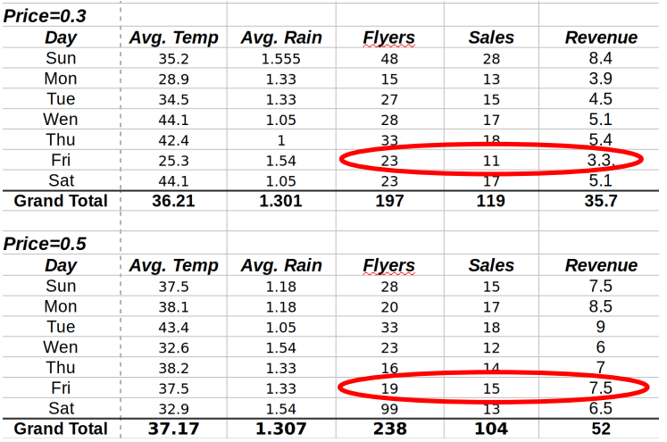

 

# Visualization

* Line plot

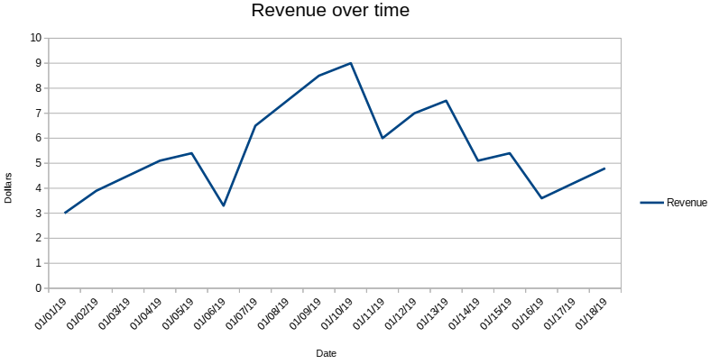

* Column chart

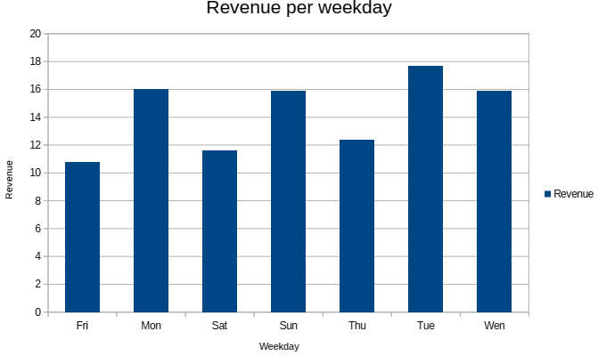

* Joint column chart

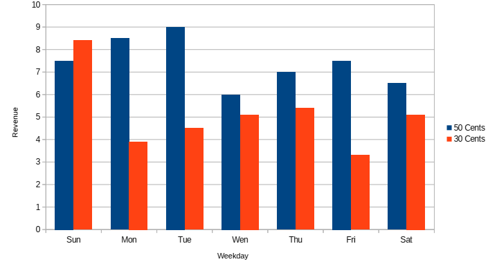

* Scater plot

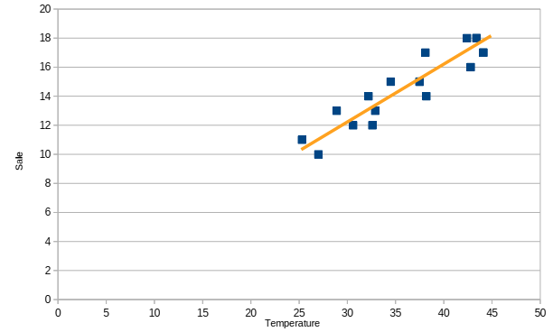

# Statistical analysis

Statistics is the core of data science.

Using Statistics:

* You can see the distribution of the data

* How much variance there is between values

* How changes in one feature affect values of other features

The first point to start is **descriptive statistics**
